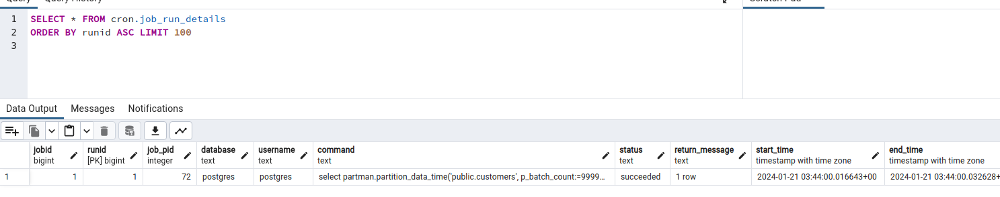

# Postgresql partman
PostgreSQL Partman Example, demonstrates how to create partitions on demadand for a postgreSql table
This is using 100% PostgreSQL technology, and I use docker and docker-compose just to simulate the server


:dancers: 

## Build
In order for this demo to work, we need to create a docker image with PostgreSQL 16.1, PG_Partman and PG_Cron extensions.
To do that we run ./build.sh script


## Running Postgresql Sharding
The only concern to run this demo is to make sure posrgresql is not running already on your host machine, as the master runs on port 5432 it may collide with an existing running instance.

| Servers     | Port  | Table          |
| ------------| ------|----------------|
| pg_master   | 5432  | customers      |


:woman_dancing:
to start the server run:
```
docker-compose up
```
to stop the server (and keep the data)
```
docker-compose down
```
to stop the server (removing the database, it will be recreated again next time you docker-compose up)
```
docker-compose down -v
```

## Checking if it works
1 - Connect you pgAdmin to the instance:


3 - run sql statemet to check the pg_db:
- SELECT * FROM cron.job ORDER BY jobid ASC (to check the job scheduled)
- SELECT * FROM cron.job_run_details ORDER BY runid ASC (to check if the job has run successfuly)
- SELECT * FROM public.customers (To check the data inserted by default)


### go into the public table and check the partitions available:


### Add Extra Data:
go into the ./scripts/init-db.sh and copy some commented sql (super villains) at the botton


### Check the default partition and confirm they are there:


Wait for 1 minute .. and check if the script has run ..



### Check the new partitions recentrly created:


and check if the data is there


